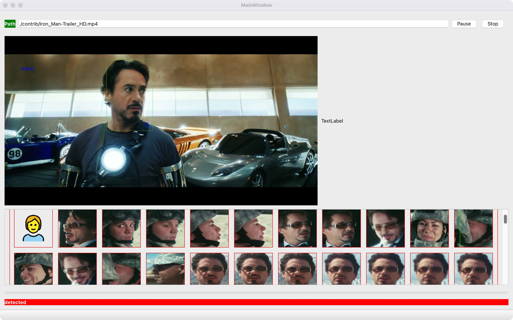

## Face Cards

#### Introduction

A face aggregation application, showing how to use [donde-toolkits](https://github.com/sekirocc/donde-toolkits)



#### Build

##### Build conan dependencies

```bash
mkdir -p generated
conan install --build=missing  -of generated ./conan
```

##### Build app

```bash
mkdir -p build && cd build
cmake -DCMAKE_TOOLCHAIN_FILE=../generated/conan_toolchain.cmake -DCMAKE_BUILD_TYPE=Debug ..
cmake --build .
```

or with CLion, configure CMake option with `-DCMAKE_TOOLCHAIN_FILE=./generated/conan_toolchain.cmake`,
and reset CMake cache.
